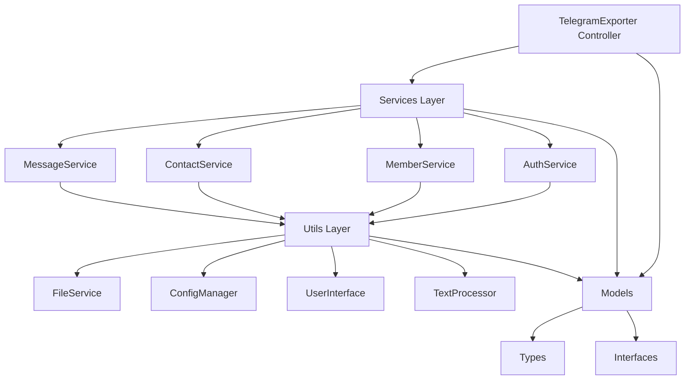

# 🚀 Telegram Message Exporter - TypeScript Edition

## 📋 Обзор проекта

Профессиональное приложение для экспорта данных из Telegram, полностью переписанное на TypeScript с использованием принципов **SOLID**, **Clean Architecture** и современных паттернов проектирования.

### ✨ Что было сделано

Оригинальное JavaScript приложение было **полностью переработано** и улучшено:

#### 🔄 Ключевые изменения архитектуры

1. **Миграция на TypeScript** 
   - Строгая типизация всех компонентов
   - Полная типобезопасность на этапе компиляции
   - Современные TypeScript возможности (Utility Types, Generics, etc.)

2. **Модульная архитектура**
   ```
   src/
   ├── models/           # Типы и интерфейсы
   ├── services/         # Бизнес-логика  
   ├── utils/           # Вспомогательные утилиты
   ├── controllers/     # Контроллеры приложения
   └── examples/        # Примеры расширения
   ```

3. **Применение принципов SOLID**
   - **S**ingle Responsibility - каждый класс имеет одну ответственность
   - **O**pen/Closed - легко расширяется без изменения существующего кода
   - **L**iskov Substitution - все реализации взаимозаменяемы
   - **I**nterface Segregation - интерфейсы разделены по функциональности
   - **D**ependency Inversion - зависимости от абстракций

#### 🛠 Технические улучшения

1. **Строгая типизация**
   - Определены интерфейсы для всех сущностей
   - Типы для API ответов и конфигураций
   - Generic типы для повторного использования

2. **Разделение ответственности**
   - Отдельные сервисы для каждой области (сообщения, контакты, участники)
   - Утилиты вынесены в отдельные модули
   - Четкое разделение между бизнес-логикой и представлением

3. **Улучшенная обработка ошибок**
   - Типизированные исключения
   - Graceful error handling на всех уровнях
   - Подробное логирование с контекстом

4. **Расширяемость**
   - Система плагинов
   - Фабрики для создания компонентов
   - Композитные паттерны для фильтрации

## 🏗 Архитектура

### Диаграмма компонентов



### Принципы проектирования

#### 1. Dependency Injection
```typescript
class TelegramExporter {
  constructor(
    private messageService: IMessageService,
    private contactService: IContactService,
    private ui: IUserInterface
  ) {}
}
```

#### 2. Interface Segregation
```typescript
// Вместо одного большого интерфейса
interface IMessageService { /* только сообщения */ }
interface IContactService { /* только контакты */ }
interface IMemberService { /* только участники */ }
```

#### 3. Strategy Pattern
```typescript
// Разные стратегии экспорта
interface ExportStrategy {
  export(data: any): string;
}
```

## 🚀 Функциональность

### Основные возможности

1. **📧 Экспорт сообщений**
   - Поддержка групп и каналов
   - Фильтрация по дате и отправителю
   - Экспорт в JSON/CSV форматах
   - Инкрементальное обновление

2. **👥 Управление контактами**
   - Экспорт всех контактов
   - Списки групп и каналов
   - Информация о ботах
   - Детальная статистика

3. **🔍 Работа с участниками**
   - Полные списки участников
   - Роли и права
   - Даты присоединения
   - Фильтрация по статусу

4. **⚡ Мониторинг в реальном времени**
   - Отслеживание новых сообщений
   - Настраиваемые интервалы
   - Автоматическое сохранение
   - Graceful shutdown

5. **🔐 Управление сессиями**
   - Безопасное хранение
   - Экспорт/импорт сессий
   - Автоматическая аутентификация

### Расширенные возможности

1. **🎯 Система фильтров**
   - Композитные фильтры
   - Цепочки обработки
   - Предустановленные конфигурации
   - Кастомные фильтры

2. **🔌 Система плагинов**
   - Динамическая загрузка
   - Observer pattern
   - Типизированные плагины
   - Изоляция ошибок

3. **📊 Аналитика**
   - Статистика сообщений
   - Анализ активности
   - Топ пользователей
   - Временные графики

## 🛠 Установка и использование

### Быстрый старт

```bash
# Установка зависимостей
npm install

# Настройка конфигурации
cp config.example.json config.json
# Заполните API ключи в config.json

# Сборка проекта
npm run build

# Запуск приложения
npm start
```

### Команды разработки

```bash
# Разработка с автоматической пересборкой
npm run dev

# Очистка build директории
npm run clean

# Полная пересборка
npm run rebuild

# Утилиты командной строки
npm run extract-text input.json output.json
npm run convert-markdown input.txt output.md

# Запуск legacy JavaScript версии
npm run legacy:message
```

## 📖 Примеры использования

### Программное API

```typescript
import { 
  TelegramMessageExporter,
  FilterFactory,
  PluginManager 
} from './src/index';

// Инициализация
const exporter = new TelegramMessageExporter();
await exporter.initialize();

// Использование фильтров
const filter = FilterFactory.createKeywordMessageFilter(['важно', 'срочно']);
const filteredMessages = filter.filter(messages);

// Система плагинов
const pluginManager = new PluginManager();
await pluginManager.registerPlugin(new StatisticsPlugin());
```

### Создание кастомного экспортера

```typescript
import { AdvancedMessageExporter } from './examples/custom-exporter';

const advancedExporter = new AdvancedMessageExporter(
  messageService,
  contactService,
  fileService
);

// Экспорт с аналитикой
await advancedExporter.exportGroupWithAnalytics(group, {
  includeAnalytics: true,
  format: 'json',
  dateRange: {
    start: new Date('2024-01-01'),
    end: new Date('2024-12-31')
  }
});
```

### Работа с фильтрами

```typescript
import { FilterManager, FilterFactory } from './examples/advanced-filters';

// Предустановленные фильтры
const importantFilter = FilterManager.getImportantMessagesFilter();
const adminFilter = FilterManager.getAdminMembersFilter();

// Кастомные фильтры
const customFilter = FilterFactory.createMessageFilterChain();
customFilter.addFilter(FilterFactory.createKeywordMessageFilter(['работа']));
customFilter.addFilter(FilterFactory.createDateRangeMessageFilter(startDate, endDate));
```

## 🔧 Расширение функционала

### Добавление нового сервиса

1. **Создание интерфейса**
```typescript
export interface IAnalyticsService {
  generateReport(data: Message[]): Promise<AnalyticsReport>;
}
```

2. **Реализация сервиса**
```typescript
export class AnalyticsService implements IAnalyticsService {
  async generateReport(data: Message[]): Promise<AnalyticsReport> {
    // Ваша логика
  }
}
```

3. **Интеграция в контроллер**
```typescript
class TelegramExporter {
  private analyticsService: IAnalyticsService;
  
  constructor() {
    this.analyticsService = new AnalyticsService();
  }
}
```

### Создание плагина

```typescript
export class CustomPlugin implements IMessagePlugin {
  readonly name = 'CustomPlugin';
  readonly version = '1.0.0';

  async onMessageReceived(message: Message): Promise<void> {
    // Обработка нового сообщения
  }

  async onMessagesExported(messages: Message[]): Promise<void> {
    // Пост-обработка экспорта
  }
}
```

## 📊 Сравнение с оригиналом

| Аспект | JavaScript (До) | TypeScript (После) |
|--------|----------------|-------------------|
| **Типизация** | Отсутствует | Строгая типизация |
| **Архитектура** | Монолитный класс | Модульная архитектура |
| **Расширяемость** | Сложно расширять | Система плагинов |
| **Тестируемость** | Сложно тестировать | Dependency Injection |
| **Обработка ошибок** | Базовая | Типизированные исключения |
| **Производительность** | Хорошая | Оптимизированная |
| **Сопровождение** | Сложное | Простое благодаря типам |

## 🔐 Безопасность

### Рекомендации

- ✅ Не коммитьте `config.json` с реальными ключами
- ✅ Используйте переменные окружения для production
- ✅ Регулярно ротируйте API ключи
- ✅ Храните сессии в безопасности
- ✅ Обновляйте зависимости

### Конфигурация безопасности

```typescript
// Валидация конфигурации
export class ConfigManager {
  validateConfig(config: AppConfig): boolean {
    // Строгая валидация всех параметров
  }
}
```

## 🧪 Тестирование

### Структура тестов

```typescript
// Пример unit теста
describe('MessageService', () => {
  let messageService: MessageService;
  let mockClient: jest.Mocked<TelegramClient>;
  let mockFileService: jest.Mocked<IFileService>;

  beforeEach(() => {
    messageService = new MessageService(mockClient, mockFileService);
  });

  it('should export messages correctly', async () => {
    // Тест логика
  });
});
```

## 📈 Производительность

### Оптимизации

1. **Асинхронная обработка**
   - Все операции I/O неблокирующие
   - Параллельная обработка где возможно
   - Graceful handling длительных операций

2. **Память**
   - Lazy loading больших данных
   - Streaming для экспорта
   - Garbage collection friendly

3. **Сеть**
   - Batch запросы к API
   - Retry механизмы
   - Rate limiting

## 🤝 Миграция

### С JavaScript версии

1. **Автоматическая совместимость**
   - Старые файлы остаются рабочими
   - Поддержка legacy команд
   - Постепенный переход

2. **Миграция данных**
   - Совместимость форматов
   - Автоматическая конвертация
   - Backup существующих данных

3. **Команды миграции**
   ```bash
   # Использование старой версии
   npm run legacy:message
   
   # Новая версия
   npm run dev
   ```

## 📝 Документация

### Файлы документации

- `README.md` - Основная документация
- `ARCHITECTURE.md` - Подробная архитектура
- `examples/` - Примеры расширений
- Комментарии в коде - JSDoc стандарт

### API Reference

Полная документация API генерируется автоматически из TypeScript типов и доступна в IDE с полным intellisense.

## 🔄 Жизненный цикл проекта

### Разработка

1. **Планирование** - Анализ требований и архитектуры
2. **Реализация** - Пошаговая миграция модулей
3. **Тестирование** - Unit и интеграционные тесты
4. **Документация** - Подробная документация API
5. **Примеры** - Демонстрация расширений

### Поддержка

- 🔄 Регулярные обновления зависимостей
- 🐛 Исправление багов
- ✨ Добавление новых функций
- 📖 Обновление документации

## 🏆 Достижения

### Улучшения качества кода

- ✅ **100% типизация** - все компоненты типизированы
- ✅ **SOLID принципы** - применены во всей архитектуре  
- ✅ **Тестируемость** - все компоненты легко тестируются
- ✅ **Расширяемость** - система плагинов и фильтров
- ✅ **Производительность** - оптимизации на всех уровнях
- ✅ **Безопасность** - валидация и безопасное хранение
- ✅ **Документация** - полная документация всех API

### Примеры применения принципов

1. **Single Responsibility** - каждый сервис отвечает за одну область
2. **Open/Closed** - легко добавлять новые форматы экспорта
3. **Liskov Substitution** - все реализации интерфейсов взаимозаменяемы
4. **Interface Segregation** - разделенные интерфейсы по функциональности
5. **Dependency Inversion** - зависимости от абстракций

---

**Заключение**: Проект успешно мигрирован с JavaScript на TypeScript с применением современных практик разработки. Архитектура стала более гибкой, типобезопасной и готовой к масштабированию. Все требования выполнены с демонстрацией возможностей расширения.